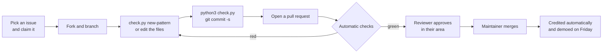

# Guardian Protocol Registry

[](https://scorecard.dev/viewer/?uri=github.com/guardianprotocol-ai/registry)
[](https://github.com/guardianprotocol-ai/registry/actions/workflows/checks.yml)

MITRE ATLAS names the attacks on AI systems. Guardian Protocol is the open, executable layer for AI agents: runnable tests, working detections and measured results, each mapped to ATLAS. Built in the open by YC founders, headed for a neutral home.

If you know security tooling: **Atomic Red Team and Sigma for AI agents, mapped to ATLAS.** [Atomic Red Team](https://github.com/redcanaryco/atomic-red-team) publishes runnable tests mapped to MITRE ATT&CK; [Sigma](https://github.com/SigmaHQ/sigma) publishes open detection rules mapped to it. Nobody had built either one for agents.

Every pattern has a stable ID, links to OWASP and MITRE ATLAS, a runnable test with a harmless payload, and a detection rule.

- The **test** powers scans: run every pattern against your agent and see which attacks get through.
- The **detection** powers sensors: block the attack in real time.
- The **result** is what the scan measured: an attack success rate for one pattern against one named model and harness, with the run count and a 95% interval. They collect in the [attack matrix](docs/MATRIX.md).
- **Sightings** will show which attacks are active right now, once the network exists. It is in design, not built: see `ARCHITECTURE.md`.

The words above are used precisely. [docs/GLOSSARY.md](docs/GLOSSARY.md) says what each one means.

**Season 1 runs October 5 to October 29, 2026.** [PROGRAM.md](PROGRAM.md) is the one page that says what we are doing, what you can pick up without asking, and when it ships. Live progress is in [docs/STATUS.md](docs/STATUS.md), generated from this repository.

**Want to contribute?** [START_HERE.md](START_HERE.md) gets you set up in about 15 minutes and points you to a first task.

New to the design? Read [ARCHITECTURE.md](ARCHITECTURE.md): the three domains of defense (actions, words, thoughts), how the registry, scan, sensor and network fit together, and the roadmap.

## How it works

Everyone here is a contributor. Fork the repository, pick an issue, open a pull request.
The machine checks everything first: format, tests, that the rules still catch attacks and
still leave ordinary work alone, and that every pattern maps to MITRE ATLAS. Then a
reviewer approves and a maintainer merges. Do good work for a few weeks and you are invited
to be a reviewer; keep reviewing well and you can become a maintainer. Your name, and your
organization if you opt in, are credited automatically, in the order people contributed.
Every week we demo what shipped.



Three roles: **contributor**, **reviewer**, **maintainer**. What each can do and how you
move between them is in [GOVERNANCE.md](GOVERNANCE.md). Start at
[START_HERE.md](START_HERE.md), which is a first contribution in about fifteen minutes.

## What's in this repository

| Folder | What it is |
| --- | --- |
| `patterns/` | One YAML file per attack pattern |
| `schema.yaml` | The pattern format |
| `coverage/` | Every MITRE ATLAS technique, triaged by where the protocol can act on it |
| `scanner/` | Validates the registry and measures an attack success rate against an agent |
| `sensor/` | Prototype MCP proxy that enforces detections in real time |
| `hooks/` | Client hooks that cover an agent's own tools, which never pass through MCP |
| `demo/` | A 90-second end-to-end demo with a visual report |

No dependencies beyond the Python 3.9+ standard library.

Coming next: reference agents beyond Claude Code, so an attack success rate can be compared across models, and scenarios for the patterns the scan cannot yet run.

## Pattern lifecycle

| Status | Meaning | Can block traffic? |
| --- | --- | --- |
| `draft` | Proposed; format valid | No |
| `verified` | Test and detection proven by automatic checks; two reviewers approved | No |
| `enforced` | Approved for sensors to act on | Yes |

## How contributions are checked

Run every check with one command:

```bash
python3 check.py
```

Every pull request runs the same script automatically. Today it checks:

1. **Format:** every pattern validates against `schema.yaml`, and its ID matches its filename.
2. **Payload safety:** canary tokens are well formed, and every destination is inside reserved, unroutable space: `.test`, `.example`, `.invalid` and `.localhost` (RFC 2606 and RFC 6761), the `example.com` family, the RFC 5737 documentation addresses, or loopback. Anything else is refused, including bare public IP addresses.
3. **Detections prove themselves:** every attack case in `corpus/attacks/` must still be caught, and the ordinary work in `corpus/benign/` must raise nothing. On pull requests, the run summary shows what the change catches and flags compared with the base branch.
4. **Rules are safe to run:** the rule lint rejects signatures that match plain prose, could hang the sensor on crafted input, or hide characters from reviewers. A change to the rules must add a test or corpus case.
5. **Tools work:** the scanner, sensor and hook test suites pass.

Coming before patterns can move past `draft`: each test run against the vulnerable reference agent (must be exploited) and the hardened one (must resist), a benign corpus large enough to measure false-alarm rates, and a duplicate check. How rules are kept safe is in [docs/RULE_SAFETY.md](docs/RULE_SAFETY.md).

Then maintainers review. Patterns need two approvals: at least one from an organization other than the contributor's, and never all from the same company. There is one maintainer today, so that rule cannot be met yet: changes are reviewed by the founding maintainer alone, and the two-approval rule starts the moment a second maintainer joins. Adding maintainers from other organizations is the project's first governance goal.

Every commit is signed off under the Developer Certificate of Origin (`git commit -s`).

## Contributing a pattern

1. Copy `docs/pattern-template.yaml` to `patterns/` and give it the next free ID. `patterns/GP-0001.yaml` is a complete example.
2. Fill in every field, including the test and the detection.
3. Run `python3 check.py`, then open a pull request. Credit goes in the `credits` field, with your name and organization.

## Reporting an incident

Don't open a public issue for an active attack or anything specific to one vendor's product. Use the private reporting process in `SECURITY.md`. We follow coordinated disclosure: affected parties hear first, and the public advisory comes after a fix or on a set timeline.

## The project

- [START_HERE.md](START_HERE.md): your first contribution
- [TRACKS.md](TRACKS.md): the areas of work
- [CONTRIBUTING.md](CONTRIBUTING.md): how to contribute
- [CONTRIBUTORS.md](CONTRIBUTORS.md): everyone who has contributed
- [THREAT_MODEL.md](THREAT_MODEL.md): how the protocol itself is protected
- [docs/RULE_SAFETY.md](docs/RULE_SAFETY.md): how a bad rule is kept out
- [docs/proposals/](docs/proposals/): designs under discussion
- [GOVERNANCE.md](GOVERNANCE.md): roles, decisions and neutrality
- [ROADMAP.md](ROADMAP.md): the next twelve months
- [docs/DECISIONS.md](docs/DECISIONS.md): design decisions and the security baseline checklist
- [CODE_OF_CONDUCT.md](CODE_OF_CONDUCT.md) and [MAINTAINERS.md](MAINTAINERS.md)

## Who maintains it

Maintained by the Guardian Protocol Research Group, a working group of YC founders and
researchers. The group's name is proposed and pending the group's decision. How it publishes
and how someone becomes an author are in [docs/RESEARCH.md](docs/RESEARCH.md).

## License

Apache 2.0.
